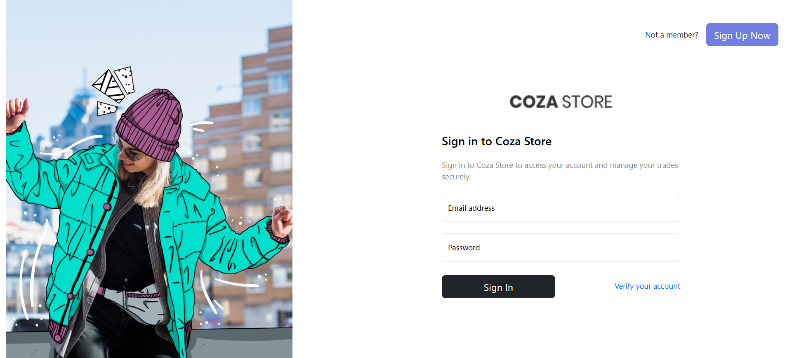
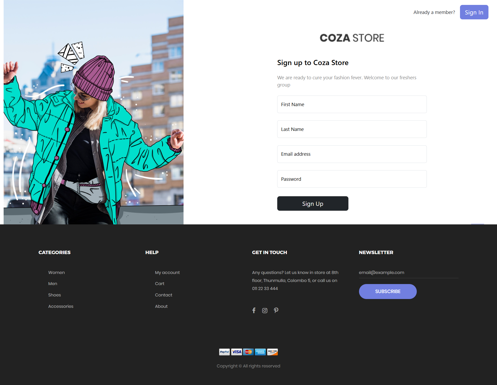
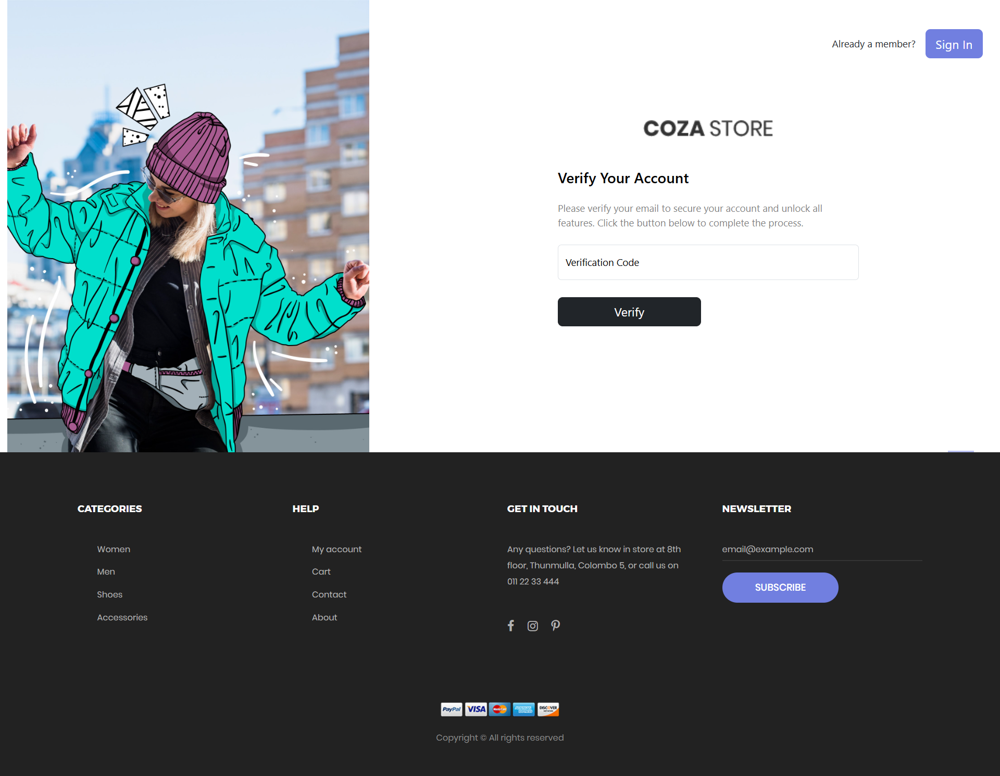
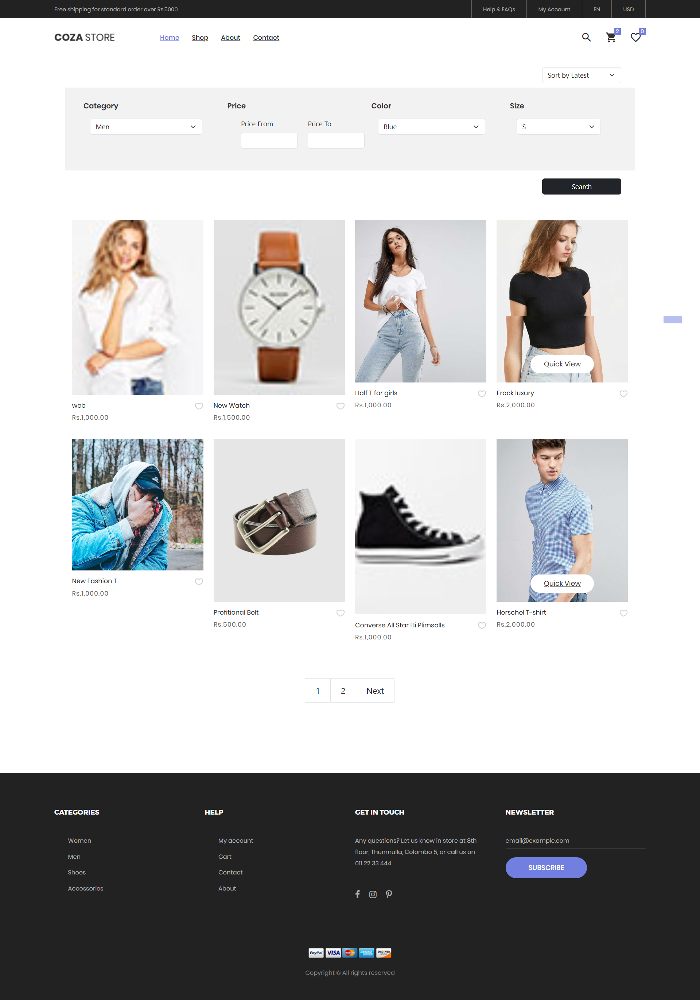
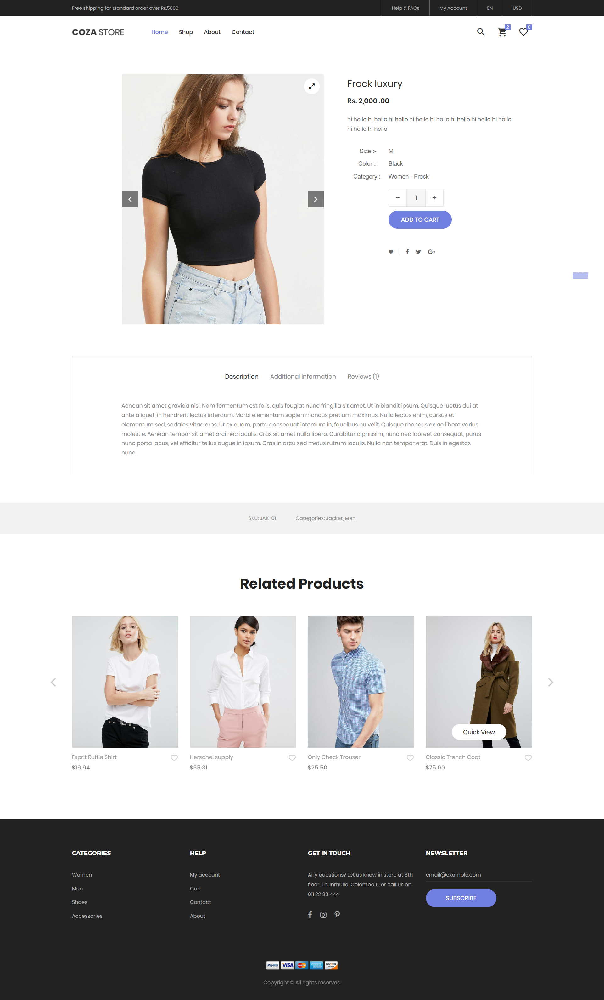
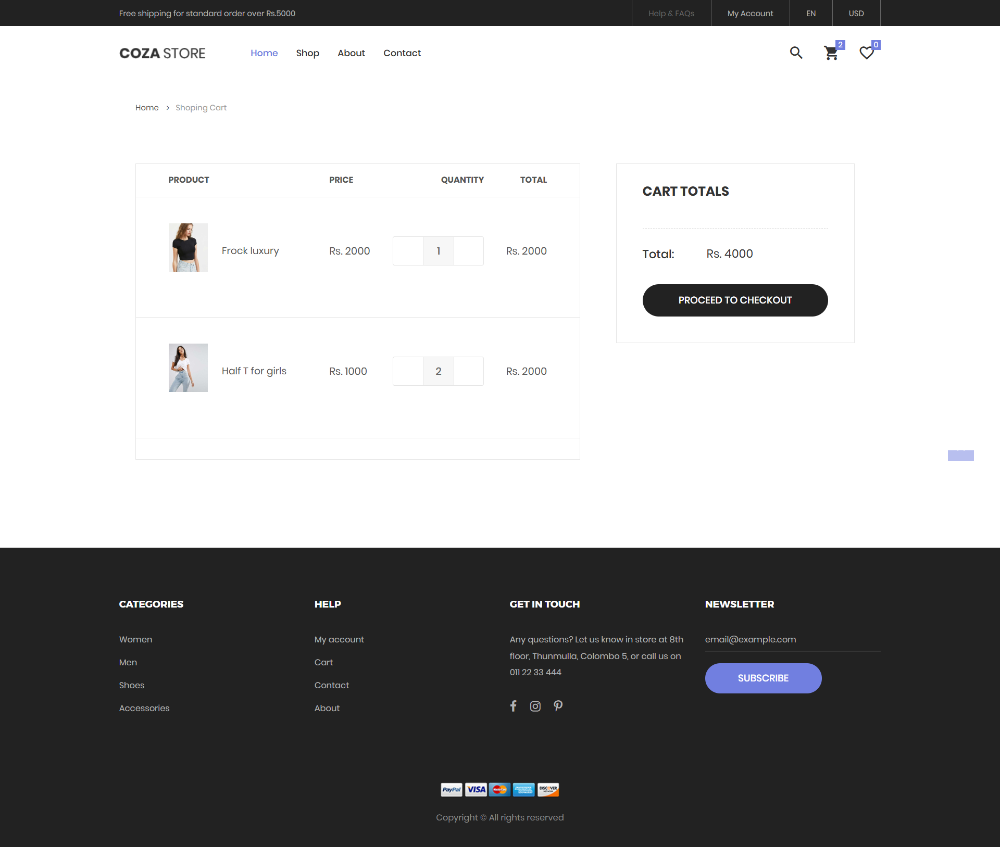
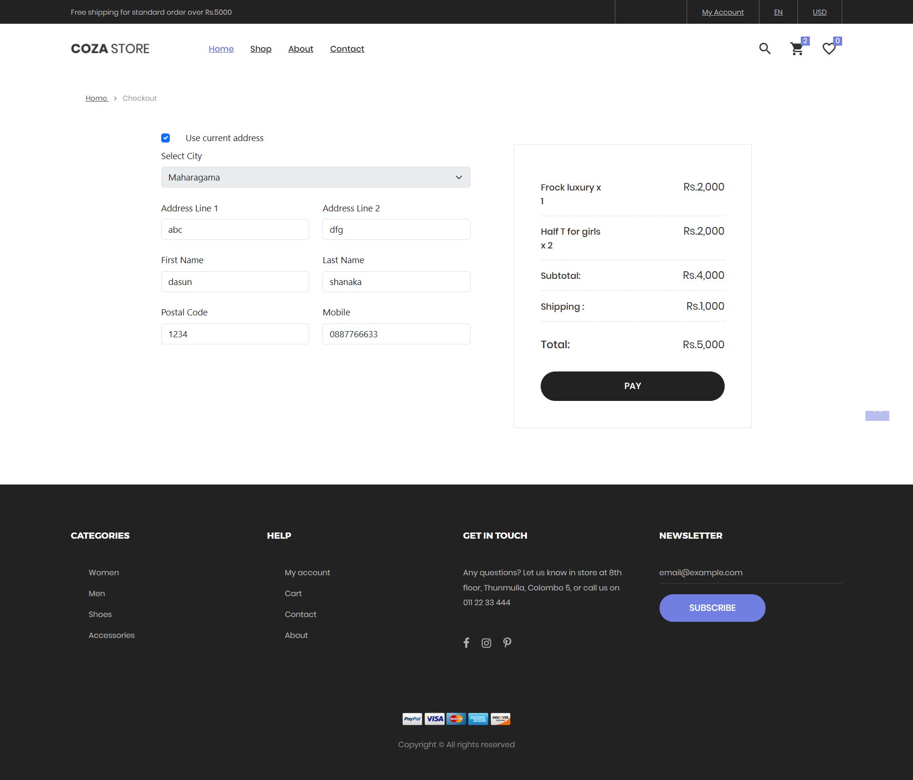
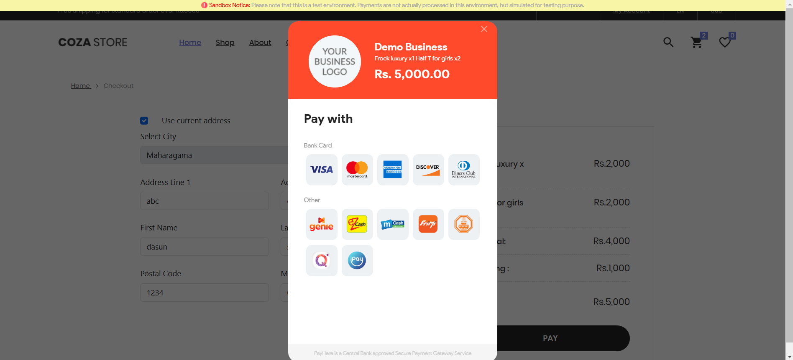
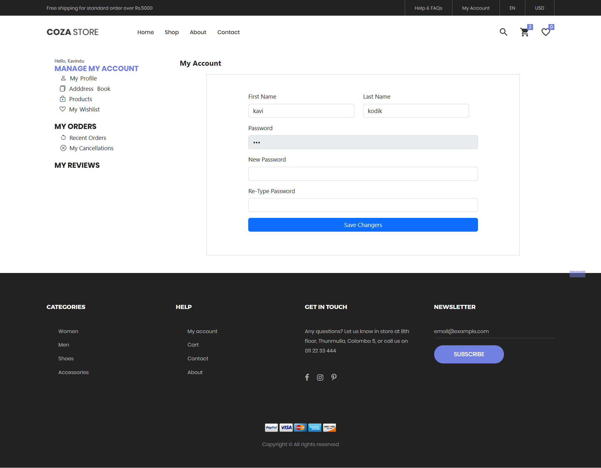
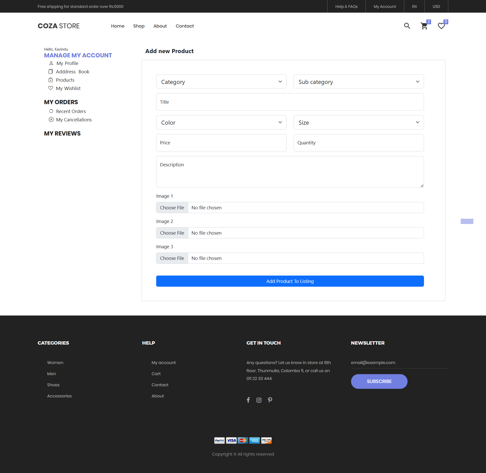

# CozaStore

CozaStore is a fully functioning and responsive Java EE e-commerce web application designed for a clothing shop. The primary focus of this project is mastering Java EE backend development with Hibernate, while also incorporating a user-friendly front end.

## Technologies Used

- **Backend**: Java EE, Hibernate
- **Frontend**: HTML, Bootstrap, JavaScript
- **Database**: MySQL
- **Payment Gateway**: PayHere

## Overview

CozaStore offers a seamless shopping experience with the following features:

- User authentication with account verification.
- Advanced product search and filtering.
- Secure checkout with payment integration.
- Account management and product listing for sellers.

Below is a detailed breakdown of each page:

---

### Sign In / Sign Up / Verify Account

Users can create an account or sign in using their credentials. Upon registration, users are redirected to a verification page where they must enter the code sent to their email to activate their account.

  

 

 

 

---

### Home Page

The home page showcases featured products and includes navigation links to other sections of the application.

  

 

---

### Shop Page

The shop page allows users to browse and search for products. The advanced search feature helps users find items based on various criteria.

  

 

---

### Single Product View

This page displays detailed information about a product, including:
- Title
- Price
- Photos
- Available colors and sizes
- Category

Users can also add the product to their cart from this page.

  

 

---

### Cart

The cart page provides an overview of selected products, including their details and the total price. Users can proceed to the checkout from here.

  

 

---

### Checkout

At checkout, users can:
- Add a new address for delivery
- Use an existing address

After confirming their details, they can make the payment through the integrated PayHere payment gateway.

  

 

 

---

### My Account

The account management page allows users to:
- Update personal details (e.g., first name, last name, password).

  

 

---

### Product Page (For Sellers)

This page enables sellers to list new products on CozaStore by providing necessary details such as title, price, category, and photos.

  

 
---

## Additional Information

This project leverages a free template for the home page, single product view, and shop pages, while other pages are custom-built using HTML, Bootstrap, and JavaScript. The backend functionality is the core focus, ensuring a robust and scalable solution for e-commerce needs.
